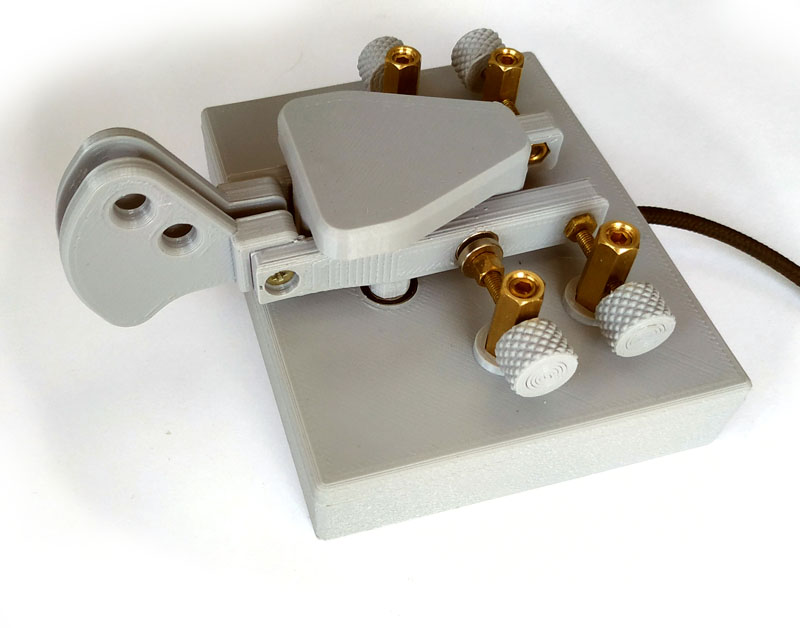
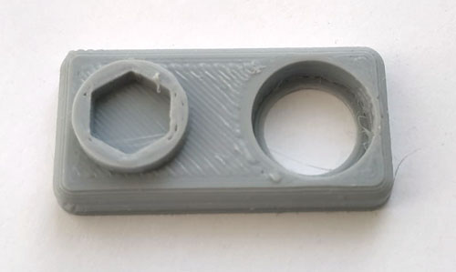
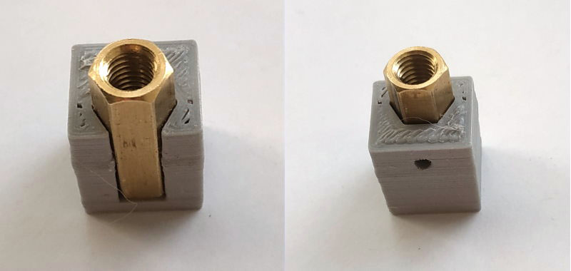
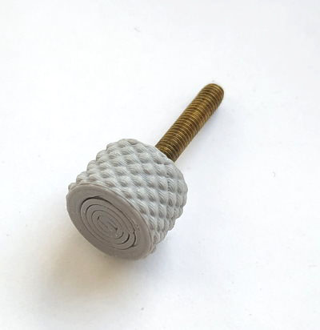
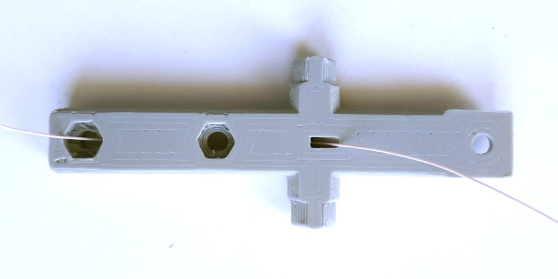
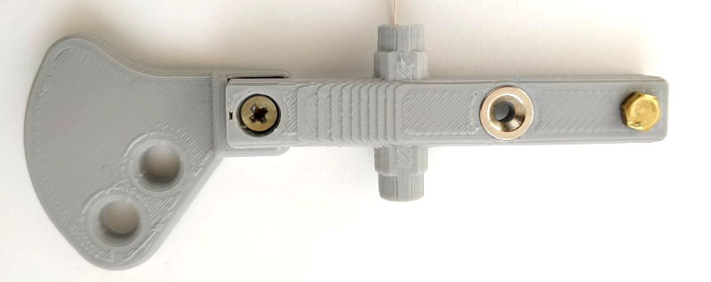
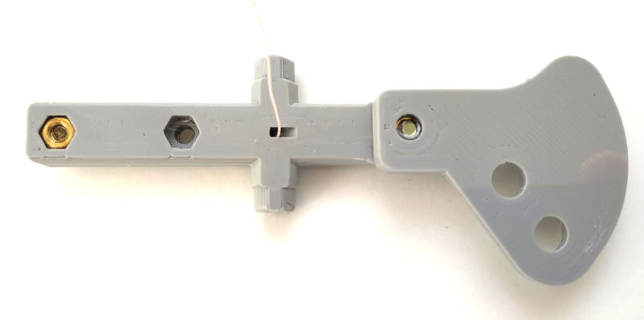
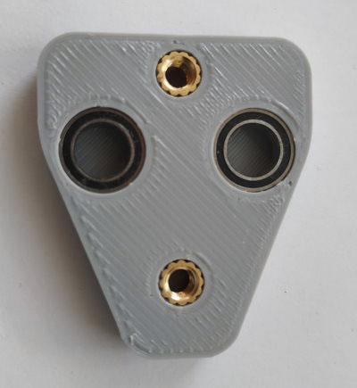
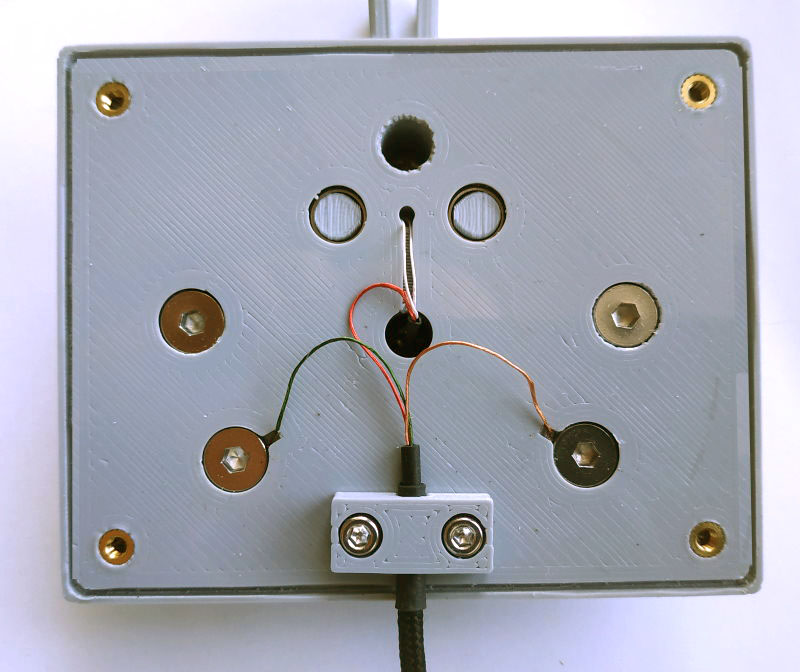
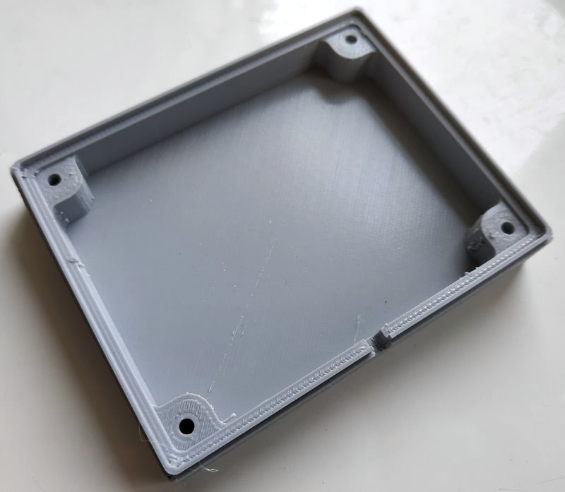

#Телеграфный манипулятор напечатанный на 3D принтере

***автор RC6OF (ex UR3IQO)***
_Проект распространятся под лицензией Creative Commons Attribution 4.0 International_

Идея напечатать CW манипулятор возникла после знакомства с разработкой EA7HVO (https://www.instructables.com/3D-Printed-Twin-Paddle-Cw-Key/). Однако его конструкция не устраивала меня по ряду причин. Данный вариант это попытка реализовать и проверить некоторые свои идеи, а также сделать манипулятор с использованием имеющихся деталей. Не смотря на то, что идея с проводом внутри коромысел, а также основные размеры были позаимствованы у EA7HVO, все детали были заново спроектированы. В данном репозитории Вы найдете не только `.STL` файлы для печати, но и **исходные CAD модели**, которые (в отличии от ключа EA7HVO) Вы можете изменить, адаптировав под свои нужды.

##Компоненты и материалы необходимые для изготовления ключа:
1. Латунные стойки М5х18 (удлиненные гайки), 4 шт.
2. Латунные болты M3x6 (или M3x7), 2 шт.
3. Латунные болты M3x20, 4 шт.
4. Латунные гайки M3, 2 шт.
5. Латунные винты без головки под шестигранный ключ M5x4, 4 шт.
6. Латунные стойки (удлиненные гайки) М3х4, 2 шт.
7. Латунные втулки под горячую вставку M4x6x4, 2 шт.
8. Латунные втулки под горячую вставку M3x5x3, 8 шт.
9. Винты М5х10 с плоской головкой, 4 шт.
10. Винты М4х8 , 2 шт.
11. Винты M3x6 с цилиндрической головкой под шестигранник, 2 шт.
12. Винты M3x12 с цилиндрической головкой под шестигранник, 4 шт.
13. Винты M3x5 впотай, 4 шт.
14. Подшипники MR117RS (7*11*3mm), 4 шт.
15. Магниты 8x2mm с отверстием под винт М3 впотай, 4 шт.
16. Кусочки фторопластового стержня Ф4, длиной 2..3мм, 4 шт.
17. Отрезок тонкого и гибкого провода (МГТФ-0.05 или подобный), 20cm
18. Аудиокабель с штекером 3.5 или 6.5мм (для подключения ключа)
19. Около 110гр PETG филамента для печати деталей на 3Д принтере

##Как из этого всего сделать ключ
###Рекомендации по печати
- Все детали напечатаны мз пластика PETG Starplast **без поддержек** (крышка печатается лицевой частью к столу).
- Ручки регулировочных винтов и фиксаторы печатаются со 100% заполнением.
- Коромысла и ручки рычагов печатались с 30% заполнением "медовые соты" и тощиной стенок 1мм (возможно захочется более жесткие рычаги, тогда стоит еще увеличить толщину стенок).
- Остальные детали печатались с 30% заполнением "медовые соты" и тощиной стенок 0.8мм.
- Верхнее и нижнее основание по наружи печатались с использованием "нечеткой оболочки" (настраивается в слайсере).
- Важно, чтобы принтер печатал без "слоновьей ноги".

###Подготовка

Распечатайте тестовую деталь `test.stl`, чтобы проверить размеры посадочных отверстий под подшипники и стойки:

Стойка должна входить в посадочное место без особых усилий, но не должна болтаться. Подшипник должен входить с усилием и надежно фиксироваться без люфта. При необходимости откорректируйте размеры в файлах `base-top.scad` и `cover.scad`, и сгенерируйте заново `.STL` файлы для печати.

###Стойки
Распечатайте кондуктор для сверления отверстий в стойках (1) `drill_conductor.stl`. Используя кондуктор для сверления стоек `drill_conductor.stl` просверлите сквозные отверстия в стойках (в домашних условиях лучше сверлить отдельно с каждой стороны по кондуктору сверлом Ф1.8..2мм, а потом рассверлить насквозь под нарезание резьбы М3):

Нарежьте сквозную резьбу М3.

###Регулировочные винты
Распечатайте ручки  `knob.stl` и фиксаторы винтов `knob-lock.stl` (в четырех экземплярах). Фиксаторы винтов `knob-lock.stl` положите в морозилку на 20..30 минут. Соберите винты: установите болт M3x20 (3) в ручку `knob.stl`, затем установите все это на какое-то основание с отверстием в которое свободно пройдет винт (я использовал доску с отверстием Ф4мм) достаньте фиксатор `knob-lock.stl` из морозилки и быстро (пока он не нагрелся) с силой вставьте его в ручку, зафиксировав винт. Чтобы это было удобно делать лучше давить на фиксатор исползуя кусочек дерева или пластика для достижения необходимого усилия. Винт должен четко фиксироваться внутри ручки, а фиксатор должен быть заподлицо с поверхностью ручки. 

Винты регулировки усилия вкрутите в стойки, магниты (15) с помощью винтов впотай М3х5 (13) прикрутите к стойкам (6), затем стойки с магнитами накрутите на винты регулировки усилия.

###Рычаги
Напечатайте коромысла и ручки. Протяните провод через коромысла:

Установите в них магниты (можно их приклеить или закрепить винтом с гайкой, можно и просто вставить в посадочное место, если они плотно входят и хорошо держатся). Зачистите конец провода со стороны винта-контакта, и установите болт М3х6 (2) с гайкой М3(4) на коромысло так, чтобы обеспечивался надежный контакт провода с болтом. Используя паяльник установите в ручки гайки под горячую запрессовку M3x5x3 (8):

С помощью винтов впотай М3х5 (13) закрепите ручки на коромыслах (ручки можно поменять местами в зависимости от предпочтений оператора, при необходимости это можно сделать и после сборки ключа).

###Крышка
Распечатайте крышку `cover.stl`. Используя паяльник установите в крышку гайки под горячую запрессовку M4x6x4 (7). Установите подшипники (14), они должны входить с усилием и надежно фиксироваться без люфтов.

###Основание
Распечатайте верхнее основание `base-top.stl`. Для улучшения качества печати отверстия крепления крышки и стоек будут запечатаны одним слоем пластика, его необходимо удалить (острым ножем, сверлом или надфилем). Используя паяльник установите в основание гайки под горячую запрессовку M3x5x3 (8). Установите подшипники (14), они должны входить с усилием и надежно фиксироваться без люфтов.

###Окончательная сборка
Пропустите провода от коромысел в отверстие в верхнем основании, установите коромысла в подшипники (коромысла должны входить в подшипники с усилием и фиксироваться без люфта). Установите крышку и зафиксируйте ее винтами M4x8 (10). Установите стойки с винтами и магнитами и зафиксируйте их винтами М5х10 (9). Подготовьте кабель, землю спаяйте с проводами, идущими к коромыслам, а провода "точек и тире" прижмите головками винтов крепления стоек. Зафиксируйте кабель с помощью винтов М3х6 (11). 

Распечатайте нижнее основание `base-bottom.stl`. 

Установите верхнее основание на нижнее и закрепите винтами М3х12 (12). После сборки вставьте в стойки (сверху) кусочки фторопласта и придавите их винтами M5х4 без головок (5). Отрегулируйте этими винтами усилие поворота регулировочных винтов.

В нижней части основания ключа достаточно места, чтобы добавить утяжелитель (например, кусочек свинца 10мм высотой позволит довести общий вес до 700..800гр., снизу можно приклеить липучку для телефона или основание от коврика для мышки).

Успехов!
73 de RC6OF (ex UR3IQO)
P.S. При проектировании деталей данного ключа были использованы библиотеки Knurled Surface (https://github.com/smkent/knurled-openscad) и Round Anything (https://github.com/Irev-Dev/Round-Anything)
