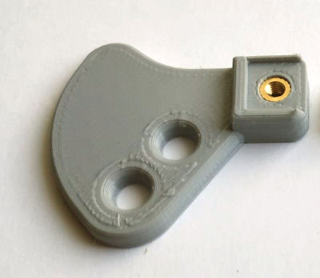

_[Описание на русском здесь](README_RU.md)_

# 3D Printed CW Paddle 
***designed by UR3IQO***
_This project is distributed under Creative Commons Attribution 4.0 International license_

This paddle design uses some ideas and dimensions from the EA7HVO 3D printed paddle. But all parts as well as overall construction was redesigned, so I was able to implement my ideas about keyer construction. In this repository you will find `.STL` models as well as **OpenSCAD sources**, and (unlike the original EA7HVO design) **you can modify them** to  suit your requirements.

## Parts and materials needed to build the keyer
1. Brass stans with M5 inner thread 18mm length, 4 pieces 
2. Brass M3x6 (or M3x7) bolts, 2 pieces
3. Brass M3x20 bolts, 4 pieces
4. Brass M3 nuts, 2 pieces
5. Brass headless allen head screws M5x4, 4 pieces
6. Brass stands M3x4, 2 pieces
7. Brass heat threaded inserts (M3x5x3), 8 pieces
8. Brass heat threaded inserts (M4x6x4), 2 pieces
9. Screws with flat head M5x10, 4 pieces
10. M4x8 screws, 2 pieces
11. M3x6 screws, 2 pieces
12. M3x12 screws, 4 pieces
13. M3x5 screws flush head, 4 pieces
14. MR117RS bearings (7*11*3mm), 4 pieces
15. 8x2mm magnets with hole for M2 screw, 4 pieces
16. Teflon rod pieces 4mm diameter 3mm long, 4 pieces
17. Piece of thin flexible wire, 20cm
18. Audio cable
19. Approximately 110g of the PETG plastic for 3D printer

## Instructions to build
### 3D printing recomendations
- All parts are printed using PETG filament
- Knobs and knob locks are printed with 100% fill
- Paddles and paddle handles are printed with 30% fill (honeycomb fill pattern) and with 1mm wall thickness
- All other parts are printed with 30% fill (honeycomb fill pattern) and with 0.8mm wall thickness
- "Fussy skin" slicer setting was used when printing outer walls of the top and bottom base parts (this change only paddle appearance)

### Preparing
Print `test.stl` part and check if mounting places for stands and bearings have correct dimensions. The bearing should fit tightly without any backlash. Correct `base-top.scad` and `cover.scad` files if needed.

### Threading the stands
Print drill conductor for stands `drill_conductor.stl`. Insert stand into the conductor and drill the hole using the smaller drill (1.8..2mm diameter) than needed for M3 thread. Drill one stand side using conductor then drill another one with stand 180degree twisted. Then use larger drill (2.3mm) to drill through the holes (through both sides) and make M3 thread.

### Adjusting screws with knurled knob
Print `knob.stl` and `knob-lock.stl` (print 4 knobs and 4 locks). Put locks into the freezer for 20..30min. Insert M3x20 bolt into the knob, get the lock from the freezer and quickly (while lock is cold) fix bolt with the lock. You will have to apply some force to do it, so it is better to put knob with bolt on some surface (with the hole for the bolt) and use piece of wood or plastic to push the lock.

Connect magnets and small stands (M3x4) using M3x5 screw with flush head. Then assemble it with adjusting screw and big stands prepeared above. 

### Paddles
Print paddles and handles `paddle*.stl`. Thread the wire in the paddle.

Mount magnets (they can be glued, or screwed with M3 screw and nut, or just tightly inserted into the mounting hole).
Screw the nut and bolt to the paddle, so they have a contact with the wire. Use soldering iron to install hot insertion nuts (M3x5x3) into paddle handles:

Assemble paddle with handle using flush head M3x5 screws. Left/right handle can be mounted on any paddle, use more confortable for you variant (they also can be interchanged if needed later, after the paddle would be assembled).

### Cover

Print the cover `cover.stl`. Use soldering iron to install hot insertion nuts (M4x6x4) into the cover. Insert bearings into the packets on the cover.

### Base

Print the top base `base-top.stl`. The top base will have thin plastic layer inside some holes, remove it with sharp knife or drill. Use soldering iron to install hot insertion nuts (M3x5x3) into the top base. Insert bearings into the packets on the top base.

### Final assembly

Pass paddle wires through the hole on the top base, put paddles shaft into the bearings, put cover and screw it using the M4x8 screws. Screw stands with adjusting screws using M5x10 screws. Prepare the cable, put dash/dot lines under the heads of the M5x10 screws (that holds stands with contact screws) and tighten them. Solder earth wire with the paddles wires.

Print bottom part of the base `base-bottom.stl`. 

Assemble top and bottom parts of the base and screw them using M3x12 screws. Put small pieces of the teflon rod into the M5x18 stands and screw the headless screws. Adjust them so that adjusting screws rotate with comfortable force.

There is enough space in the bottom base part to put some weight there. With a suitable piece of lead the keyer may weight up to 700g. Also it would be nice addition to glue some antislip material (like the bottom layer of the mouse pad) underneath the base bottom. 

Enjoy!
73 de RC6OF (ex UR3IQO)

P.S. Knurled Surface  (https://github.com/smkent/knurled-openscad) and Round Anything (https://github.com/Irev-Dev/Round-Anything) libraries were used in this project
